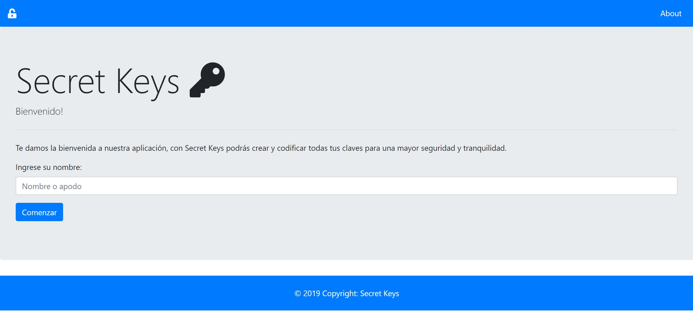
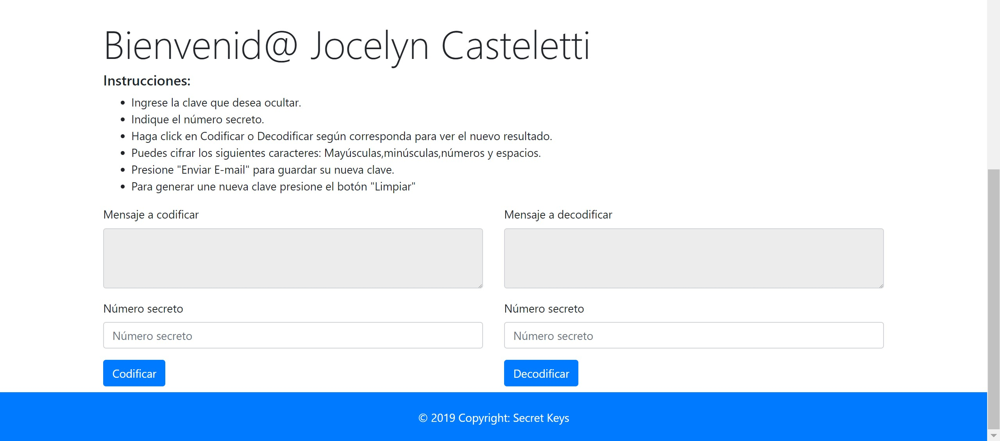
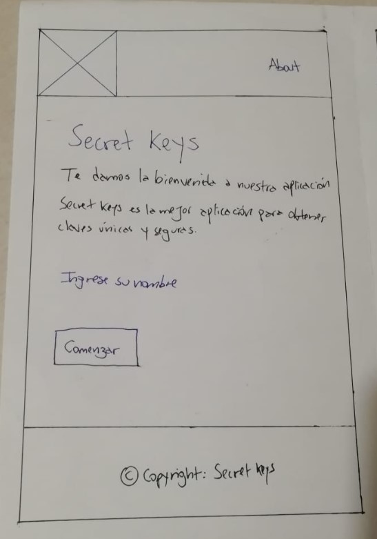

# Secret Keys 🔐

Puedes ver el proyecto [aquí](https://jocecasteletti.github.io/SCL009-Cipher/)

El presente readme tiene como finalidad documentar el proceso de creación de una aplicación web y uso del [cifrado César](https://en.wikipedia.org/wiki/Caesar_cipher).

## Indice 📖

* [Definición del Producto](#deficion-del-producto)
* [Proceso del diseño](#proceso-del-diseño)
* [Planificación del Proyecto](#planificacion-del-proyecto)
* [Historias de usuario](#historias-de-usuario)
* [Diagrama de flujo](#diagrama-de-flujo)
* [Cheklist](#Checklist)

## Definición del producto 📝
En esta aplicación el usuario podrá ingresar sus claves y poder obtener una clave secreta que solo el podrá conocer.

### Definición del usuario e ideación 💡

## Proceso del Diseño 🎨
En el desarrollo se evaluó y consideró cada uno de los criterios referidos por nuestros usuarios para el desarrollo de esta aplicación. A continuación se desglozan una serie de pautas que nos periten definir el producto:

¿Quiénes son los principales usuarios de producto?
Nuestros usuarios son especialmente hombres y mujeres que necesitan generar contraseñas seguras, pero tienen dificultad para recordarlas.

¿Cuáles son los objetivos de los usuarios de esta aplicación?
Consultar de manera rápida sobre sus claves secretas.

¿Que datos más relevantes se muestran en la interfaz?
Los usuarios requieren en la aplicación una forma sencilla para poder cifrar sus claves.

¿Cómo crees que el producto resuelve el problema que tiene tu usuario?
Secret Keys, ideal para usar desde el dispositivo móvil.

¿Cuándo utilizan o utilizarían el producto?
Al momento de crear una clave o recordarlas.

## Planificación del proyecto 📑
Con trello se llevo de manera más detallada la planifición del desarrrollo de la app el cual se pueden encontrar [aquí](https://trello.com/b/SNLUaYVB/cipher-20)

### Historias de usuario 👩🏻🧔🏻💻💡

1. Historia de usuario 1

Como: Usuario que cambio mis contraseñas

Quiero: que pueda entregar una clave secreta

Para: poder tener seguridad con mis cuentas.

CRITERIOS DE ACEPTACIÓN

* La aplicación debe tener un botón que le permita al usuario ingresar el número secreto.

* La aplicación debe mostrar un cuadro para escribir las claves y una información detallada que le permita al usuario ver las instrucciones.

2. Historia de usuario 2

Como: Usuario.

Quiero: Poder cambiar las contraseñas.

Para: no olvidar las claves.

CRITERIOS DE ACEPTACIÓN 

* La app debe tener un botón que al usuario darle click le permita limpiar el resultado.

*  La app debe tener un botón que le permita al usuario enviar al correo la nueva clave.

#### Prototipo de baja fidelidad 📋

Inicialmente se elabora prototipado de baja fidelidad para su uso en test y sesiones de diseño participativo, con la idea es conseguir una gran cantidad de información de la interacción entre la interfaz y el usuario mediante la evaluación de este prototipo.

## Diagrama de flujo 🔐

## Consideraciones técnicas 🛠️
Para el desarrollo de Secret Key, se utilizó bootstrap para el sistema de grilla.

Secret Key está implementado para cifrar o descifrar textos que incluya letras (mayúsculas, minúsculas), dígitos y espacio.

Es una página responsiva(Tamaño celular y página web)

## Checklist 🚀

* [X] Usa VanillaJS.
* [X] No hace uso de `this`.
* [X] Pasa linter (`npm pretest`)
* [X] Pasa tests (`npm test`)
* [X] Pruebas unitarias cubren un mínimo del 70% de statements, functions y
  lines y branches.
* [X] Incluye _Definición del producto_ clara e informativa en `README.md`.
* [X] Incluye historias de usuario en `README.md`.
* [X] Incluye _sketch_ de la solución (prototipo de baja fidelidad) en
  `README.md`.
* [X] Incluye el listado de problemas que detectaste.

### Parte Opcional: "Hacker edition"
* [X] Cifra/descifra minúsculas
* [ ] Cifra/descifra _otros_ caracteres (espacios, puntuación, `ñ`, `á`, ...)
* [ ] Permite usar un `offset` negativo.

#### Autor 👩🏻📌
Jocelyn Casteletti, estudiante de Laboratoria (9° Generación).